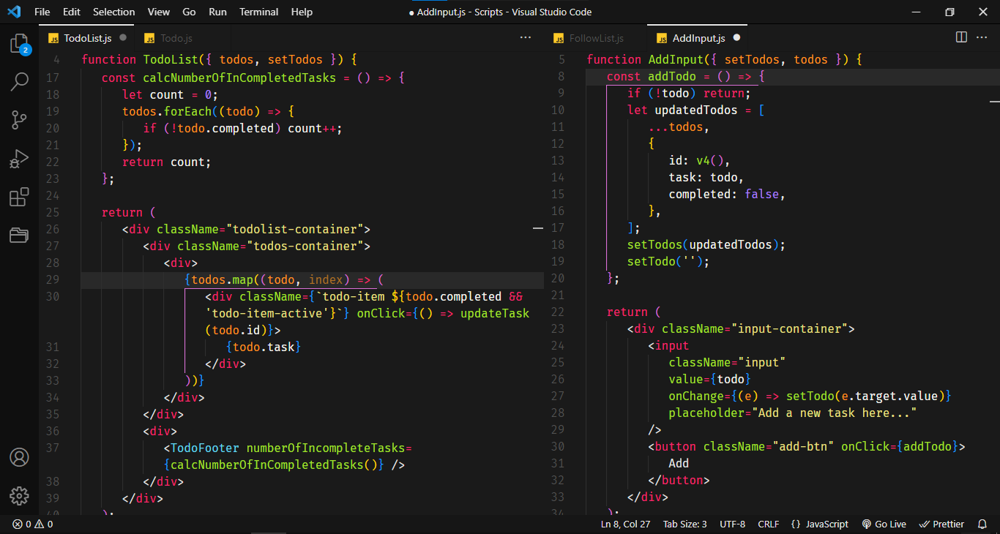

A Darker and Minimalist Monokai-Inspired Theme for Visual Studio Code.
<br>Removed Unnecessary Borders and Improve the Syntax Highlighting Colors.

## Installation

1. Open the **Extensions** Sidebar on Visual Studio Code.
2. Search for **Monokai Enhance** Theme.
3. Click **Install** to Install it.
4. Open the Command Palette with **Ctrl/Command + Shift + P**.
5. Preferences: Color Theme > Choose **Monokai Enhance**.

## Recommended Settings

```json
"editor.fontFamily": "'Fira Code', 'Operator Mono', 'Source Code Pro'",
"editor.fontSize": 15,
"editor.lineHeight": 21,
"editor.guides.bracketPairs": "active",
"editor.bracketPairColorization.enabled": true,
```

## Screenshots


<br><br>

<br><br>

<br><br>


## Contributing

Theme are still under development. If you found a problem or have a feature request, please open an [issue here](https://github.com/lattestack/monokai-enhance/issues).
<br>Any changes relevant to each version are documented in the [changelog](CHANGELOG.md).
<br>Thank you for the contributing.

